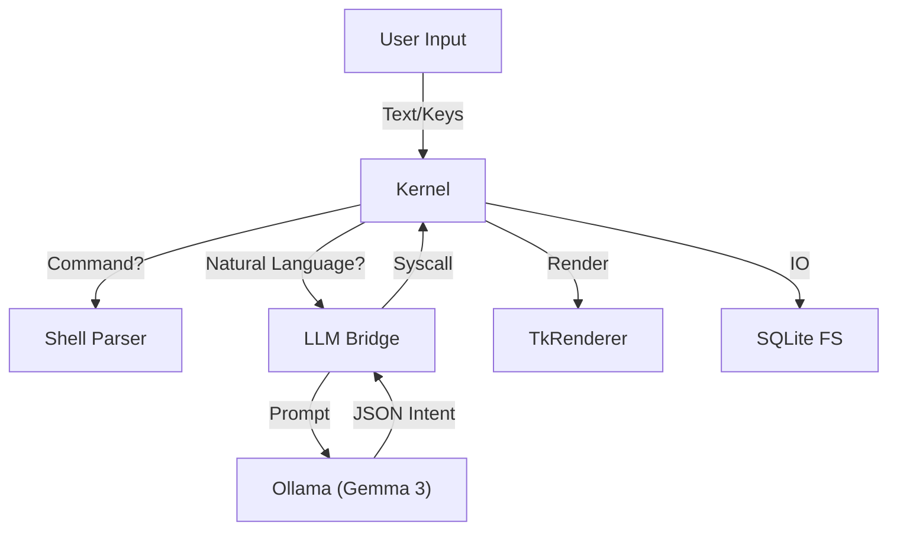

# jaxOS Architecture 🧠

## 1. Philosophy
jaxOS challenges the traditional OS paradigm by replacing the rigid kernel loop with a **Neural Inference Loop**. Instead of just waiting for interrupts, the kernel actively interprets user intent using a Large Language Model (LLM).

## 2. System Overview

### The Neural Kernel (`kernel/`)
The core of jaxOS is `NeuralKernel` in `main.py`.
-   **Event Loop**: A continuous loop that handles UI updates, input events, and "Neural Ticks".
-   **Intent Parser**: `kernel/intent_parser.py` bridges the gap between raw text and executable system calls. It sends user queries to a local Ollama instance (`gemma3:12b`) and expects a structured JSON response.
-   **Syscalls**: The kernel exposes a safe API for apps (`kernel.log`, `kernel.open_file`, `kernel.launch_app`).

### The Unified Grid UI (`ui/`)
jaxOS uses a custom, procedural rendering engine built on top of Python's `tkinter`.
-   **No Assets**: There are no images or icons. Every UI element is drawn mathematically at runtime.
-   **Grid Layout**: The `Panel` widget (`ui/widgets.py`) implements a recursive grid system. Apps define their layout in rows and columns, and the engine calculates pixel-perfect coordinates automatically.
-   **Theme**: A strict monochrome palette (Green on Black) enforces the retro-futurist aesthetic.

### The Filesystem (`fs/`)
-   **Storage**: `fs/db.py` implements a flat filesystem backed by SQLite (`system.db`).
-   **Virtual Hierarchy**: Directories are simulated via path prefixes (e.g., `/home/user/doc.txt`). This allows for O(1) file retrieval while maintaining a familiar folder structure for the user.

## 3. Application Lifecycle
Applications in `apps/` inherit from the `App` base class.
1.  **Load**: The `PackageManager` scans the `apps/` directory and imports the class.
2.  **Init**: `on_start()` is called. The app builds its UI using `Panel` and `Button` widgets.
3.  **Run**: The kernel calls `_tick()` on the active app 60 times per second.
4.  **Input**: Key presses are routed to `on_input()`.
5.  **Close**: `on_stop()` cleans up resources.

## 4. Data Flow

